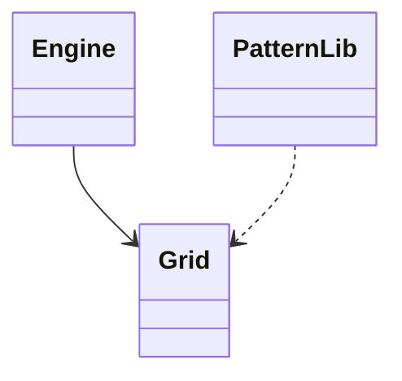

# Development

## Dependencies

Runs on [Deno][deno]. Tested with `2.9.x`.

> [!TIP]
> To check local deno version `deno --version`. To check package dependencies
> see [deno.json][deno-json].

## File System

- Folder and file names SHALL be `lower-kebab-case`.
- Documentation files SHALL be `UPPER_SNAKE_CASE`.
- Major classes SHALL be colocated with their unit tests, docs and demos in a
  folder of the same name
- Typescript type definitions located in dedicated files under `src/types`, then
  imported into source files that depend on them.
- Generic names, for fields holding utility (helper) functions, SHALL be
  avoided:
  - :x: Bad: `utils.ts`
  - :white_check_mark: good: `geometry.ts`

Example:

```
src/
├── grid/
│   ├── grid.ts         # Class def
│   ├── grid.test.ts    # Unit tests
│   ├── grid.demo.md    # Runnable demo (deno run)
│   └── GRID.md         # docs explaining the runnable demo
├── types/              # all types defined under this folder
├── data/               # YAML and JSON
├── integration/        # Integration tests that test how several classes interact together
└── mod.ts              # Package exports
```

## Architecture



### Key Classes

Each major class has a dedicated documentation page and a demo file. Code
examples provided in the doc file MUST match the code in the demo file. The demo
file is proof that the examples actually work.

| Class or Utility              | Description                                                             |
| ----------------------------- | ----------------------------------------------------------------------- |
| [Engine][engine-doc]          | Runs the simulation. Uses [Grid][grid-doc] to represent generations.    |
| [Grid][grid-doc]              | Represents a two-dimensional collection of cells                        |
| [PatternLib][pattern-lib-doc] | Tools for loading patterns. Outputs a [Grid][grid-doc]                  |
| [geometry][geometry-util]     | Utility functions operating on coord system defined by [Grid][grid-doc] |
| [seed][seed-util]             | Utility functions that help generate game sate                          |

## Quality Assurance

> [!WARNING]
> Some tests require file read permission, because the [PatternLib][pattern-lib]
> can read patterns defined in [YAML][yaml] files.

Deno native quality assurance tools SHALL be executed after making changes:

- [deno fmt][deno-fmt]
- [deno check][deno-check]
- [deno lint][deno-lint]
- [deno test][deno-test]

```bash
deno fmt --check ./src
deno check ./src
deno lint ./src
```

Automated test suite SHALL be executed before committing:

```bash
# run unit tests in watch mode, human oriented
deno task test:watch
deno task test:watch:geometry # subset shortcut
# automation, agentic coding oriented
test:once
deno task test:once:geometry # subset shortcut
```

Uses Deno's built-in test runner with `@std/assert`. Tests are hierarchical —
`Deno.test()` with nested `t.step()`.

## Version Control

Repository SHALL be versioned using `git` then pushed to GitHub. Repo `main`
branch is protected with "Require linear history" which means pull requests MUST
be squashed:

```bash
gh pr merge <number> --squash
```

### Publishing

This package SHALL be published to [JSR][jsr] on PUSH to `origin/main` via the
[publish workflow][publish-workflow] on every push to `origin/main`.

> [!TIP]
> The package version is set in [`deno.json`][deno-json]. The continuous
> integration is implemented with GitHub Actions.

JSR doesn't resolve raw text imports (`with { type: "text" }`), so the ˝built-in
patterns can't be inlined straight from [`patterns.yaml`][patterns-yaml].
Instead, [`PatternLib.fromBuiltInData()`][pattern-lib] imports a generated
[`patterns.json`][patterns-json] (via a stable `with { type: "json" }` import).
The following task SHALL be executed after editing
[`patterns.yaml`][patterns-yaml] to keep the JSON in sync. The resulting JSON
MUST be commited.

```bash
deno task patterns:build
```

The publish workflow also runs this task before publishing, so CI's copy is
always regenerated fresh from `patterns.yaml` — but a stale, uncommitted
`patterns.json` will still fail a local dry run, since `deno publish` refuses to
publish with uncommitted changes.

Because CI publishes on a version that's already merged to `main`, publish-time
issues (like an unresolvable import) are otherwise only caught after the fact.
To catch these earlier, dry-run a publish locally before merging:

```bash
deno publish --dry-run
```

This runs the same checks as CI (types, slow types, file resolution) without
uploading anything. If it succeeds locally, `deno publish` (the command CI runs)
should succeed too.

To publish for real from a local machine — for example to hotfix a release
without waiting on CI — regenerate `patterns.json` first (if `patterns.yaml`
changed), then run:

```bash
deno publish
```

<!-- Internal -->

[engine-doc]: ./src/engine/ENGINE.md
[grid-doc]: ./src/grid/GRID.md
[pattern-lib-doc]: ./src/patterns/PATTERN.md
[geometry-util]: ./src/geometry/geometry.ts
[seed-util]: ./src/seed/seed.ts
[publish-workflow]: .github/workflows/publish.yml
[deno-json]: ./deno.json
[pattern-lib]: ./src/patterns/pattern.ts
[patterns-yaml]: ./data/patterns/patterns.yaml
[patterns-json]: ./data/patterns/patterns.json

<!-- External -->

[deno]: https://deno.com/
[deno-check]: https://docs.deno.com/runtime/reference/cli/check/
[deno-lint]: https://docs.deno.com/runtime/reference/cli/lint/
[deno-fmt]: https://docs.deno.com/runtime/reference/cli/fmt/
[deno-test]: https://docs.deno.com/runtime/reference/cli/test/
[yaml]: https://yaml.org/
